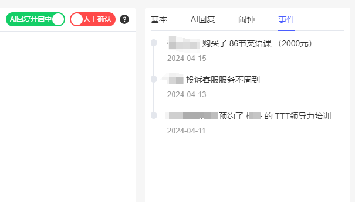

# AiVChat
企业微信/个人微信聚合消息 AI客服回复 同质化数据检索 私域运营CRM  
无需云端账号登录，PC端个人微信/企业微信继续保持在个人电脑登录

## 功能简介

多账号/多渠道消息聚合，AI回复，AI无法处理的消息，通知客服人工处理  
客户管理  CRM，自定义客户信息表单  
消息群发  
AI知识库，自研同质化数据AI检索引擎，解决当前知识库无法推荐海量SKU商品问题
简单AI流程编排，调用本地工具，复杂编排调用Coze平台工作流

### 个人微信消息Hook
同步个人微信文本/图片/文件消息，被标记为客户的消息将触发AI回复  
  

### 企业微信消息Hook
同步企业微信全部消息，被标记为客户的消息将触发AI回复  

### 消息群发
  

### 自定义客户资料表单
  
  

### AI回复人工确认 闹钟 事件功能
  
  
如果觉得AI回答不靠谱，可以修改后回答  
  
  
  
添加闹钟，不容易遗忘客户关键时间点  
  
  
  
记录关键事件，对客户行为有清晰认知  
  
  

### 其他Ai能力
  
已有数据库数据向量化  
  
  
  
AI工作流简单编排，以便更好调用本地工具  
  
  

## 联系我获取源码

备注 “github”  

  